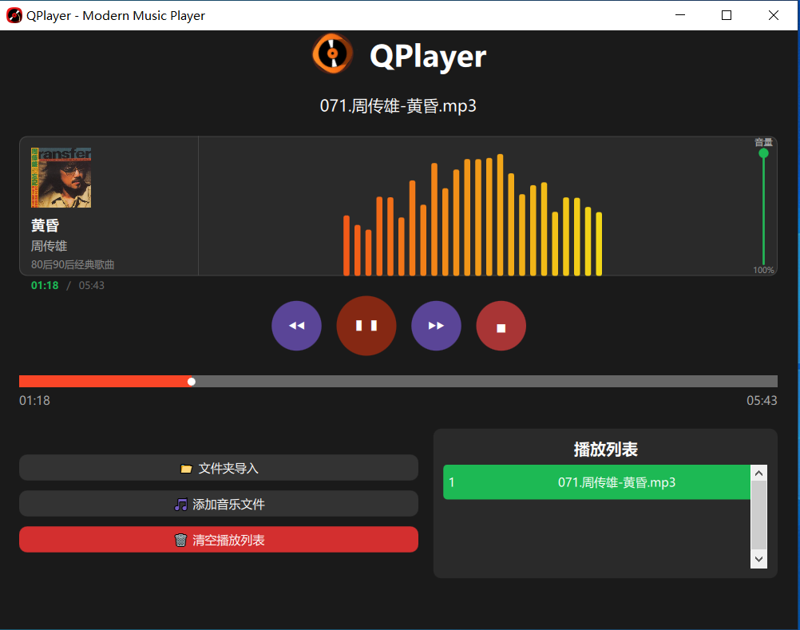

# QPlayer

简单的本地音乐播放器，基于 Qt6 和 QML。

## 功能

- 播放 MP3、WAV、FLAC、OGG、M4A 等常见音频格式
- 单曲导入或整个文件夹导入
- 播放列表管理，支持右键菜单查看属性、移除等操作
- 读取歌曲元数据（标题、艺术家、专辑、封面）
- 进度条拖动、音量滑块调节
- 音频波形可视化动画
- 专辑封面展示，找不到封面时在本地目录自动搜索

## 构建

项目使用 CMake，依赖 Qt6 的 Core、Quick、Multimedia、QuickControls2、Charts 模块。

```bash
cmake -B build
cmake --build build
```

## 运行

构建完成后直接运行生成的可执行文件。

## 页面



## 技术栈

- C++17 / Qt6 / QML
- CMake 3.20+

## License

GPL-3.0
